# Basic Pentesting — TryHackMe Writeup

**Target:** Basic Pentesting Lab Host (`10.65.139.250`)
**Environment:** TryHackMe "Basic Pentesting" room
**Tester:** Angela

## 1. Executive Summary

This lab examined a target machine that was vulnerable because one of its user accounts relied on an easily guessed password. The password was also present in known leaked-password lists, making it possible to gain access by systematically testing common credentials. Once the weakness was identified, the system could be accessed with relatively little effort, demonstrating how quickly poor password practices can lead to compromise. The issue can be reduced by enforcing longer, harder-to-guess passwords, preventing password reuse, and avoiding credentials based on common or previously exposed patterns.

## 2. Scope & Methodology

**Scope:** One host, IP address `10.65.139.250`, provided as an isolated training lab machine on the TryHackMe platform (the "Basic Pentesting" room). I tested this lab machine from my own Kali Linux machine connected to the TryHackMe lab network over OpenVPN.

**Approach:** I treated this as a black-box test, meaning I started with no credentials or insider knowledge. I followed the normal order of a real engagement: find out what services are running, look for anything exposed or misconfigured, use any information I found to guess or steal credentials, get a foothold on the machine, then use that foothold to reach the most privileged account.

**Tools used:**

- `nmap` — scanning the host and identifying open ports and services
- a web browser and `ffuf` — looking at the web server and finding hidden pages and folders
- `smbclient` — checking file sharing (SMB) access
- `hydra` — testing passwords against the SSH login
- `scp` and `ssh` — transferring files and logging in
- `ssh2john` and John the Ripper — recovering a password protecting a private key

## 3. Reconnaissance & Enumeration

My first step was a full port scan to see what was actually running on the machine.

```bash
nmap -sCV -T4 10.65.139.250
```

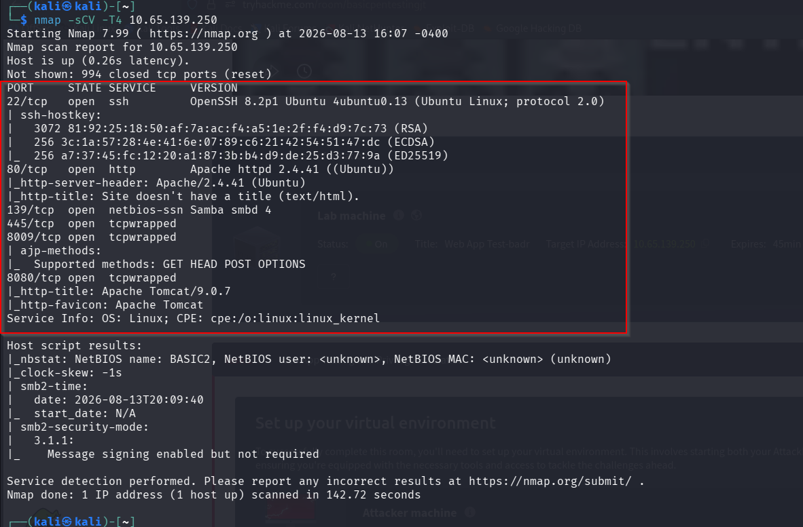

The scan showed five ports: SSH, a web server on port 80, file sharing (SMB) on 139/445, and a Tomcat application server on 8080. Since I could not explore SSH without a valid login, I checked the web server and file shares first, since they are the services most likely to leak information without needing credentials.

Port 80 only showed a placeholder "Undergoing maintenance" page, which suggested there might be more content hidden behind it that just was not linked from the homepage.

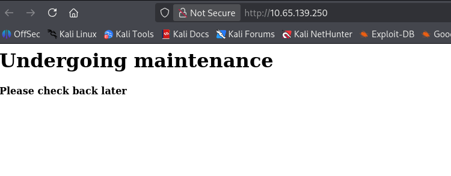

Port 8080 was running Apache Tomcat, shown by its default landing page. I noted this as a service to keep in mind, but it was not the path I used in this engagement.

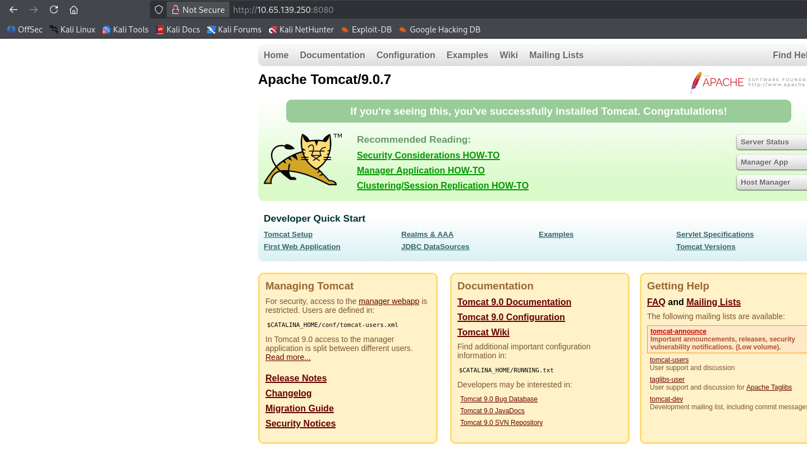

Because the port 80 site showed nothing visible, my next step was to check whether there were pages or folders that existed but were not linked anywhere, using a directory brute-force tool with a standard wordlist.

```bash
ffuf -u http://10.65.139.250/FUZZ -w /usr/share/wordlists/dirb/common.txt
```

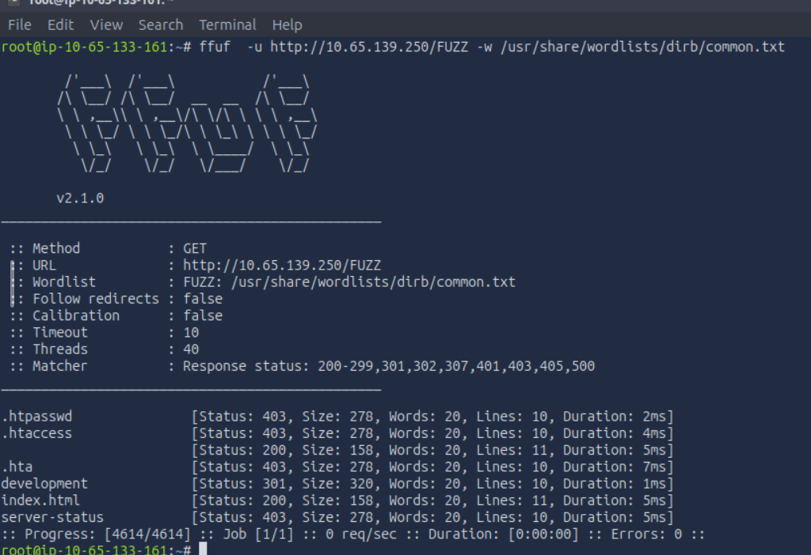

The `/development` path stood out because it redirected rather than returning a simple 403 or 404, which usually means the folder exists and is accessible. When I browsed to it, I found directory listing was turned on, exposing two text files.

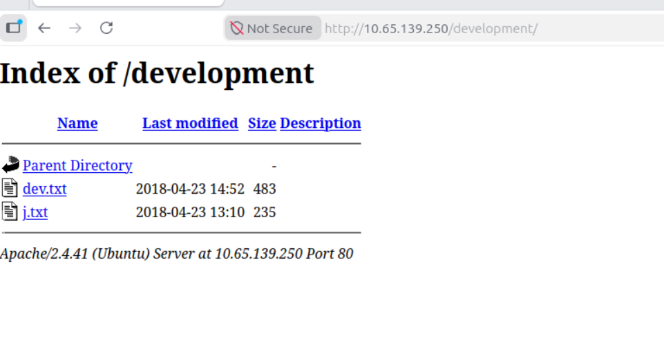

Reading these files was my natural next step, since developer notes often contain information not meant for the public, such as usernames, software versions, or hints about credentials.

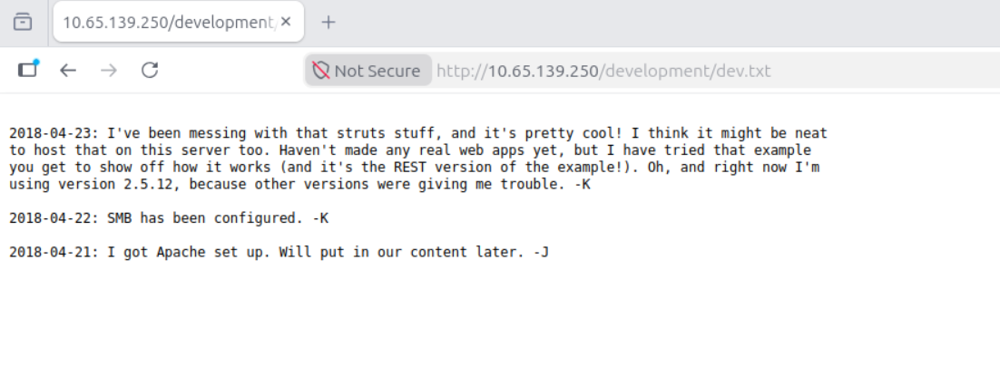

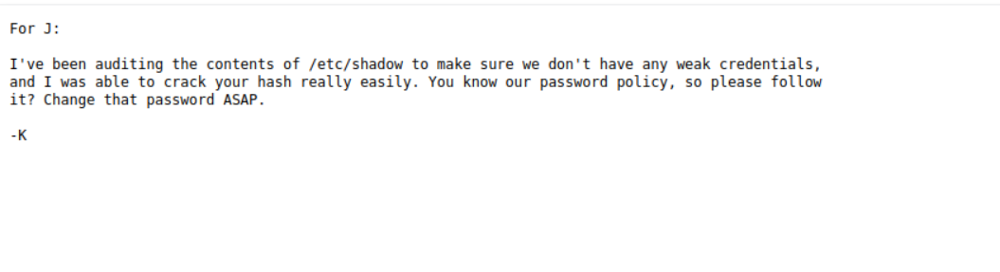

This second note was the most useful find of the whole recon phase. It told me two things directly: there is a user whose name starts with J, and that user's password is known to be weak enough to crack. This turned the next steps from guessing into a targeted attack.

Before attacking SSH, I checked the SMB service on ports 139/445, since SMB shares sometimes allow anonymous access and can leak more usernames or files.

```bash
smbclient //10.65.139.250/Anonymous -N
```

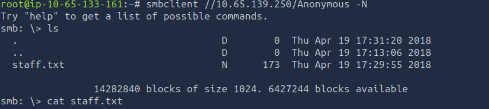

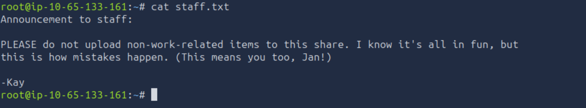

At this point, I had a strong basis for a targeted credential attack: two named accounts, jan and kay, and a direct hint that one of them has a weak, crackable password. The next step was to attack the SSH login for the user jan using a common password list.

## 4. Exploitation

With a username in hand and a hint that the password was weak, I tested the SSH login for jan against a large, well-known password list.

```bash
hydra -l jan -P /usr/share/wordlists/rockyou.txt -t 4 ssh://10.65.139.250
```

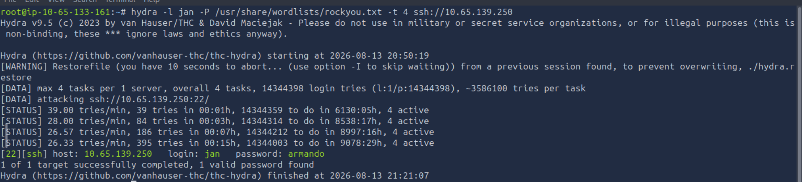

This confirmed the password was, as the developer note had warned, both weak and already known to the wordlist. I logged in with these credentials and got a working shell on the target as a low-privilege user.

```bash
ssh jan@10.65.139.250
```

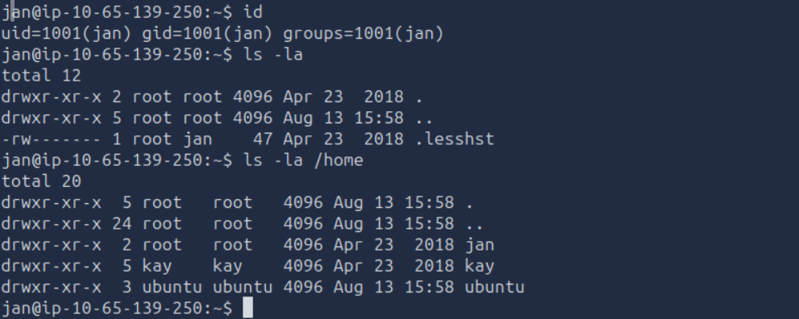

## 5. Privilege Escalation

With a shell as jan, I looked at what other users and files were reachable from this account, since `/home` showed a kay directory as well as jan's own.

```bash
ls -la /home/kay
```

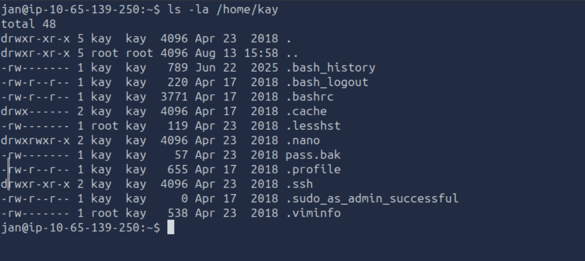

Two things stood out immediately: a `.ssh` folder, which normally holds private keys, and a file called `pass.bak`, which by its name alone suggested a stored password. Both being visible from another user's session already pointed to a file permission problem. I copied the private key over to my attack machine using secure copy protocol.

```bash
scp jan@10.65.139.250:/home/kay/.ssh/id_rsa ./kay_id_rsa
```

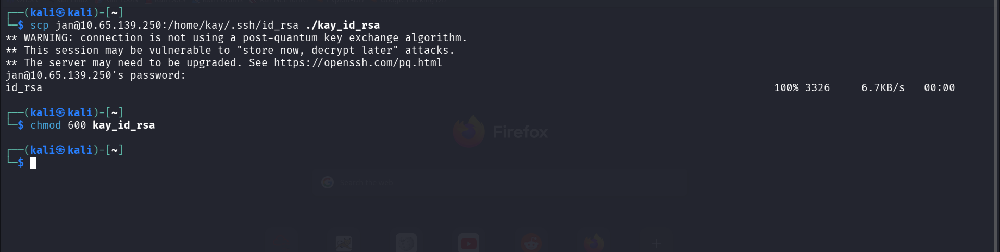

The key itself was protected by a passphrase, so I could not use it to log in straight away. I converted the key to a crackable format and ran it against the same password list I used earlier.

```bash
ssh2john kay_id_rsa > kay_hash.txt
john --wordlist=/usr/share/wordlists/rockyou.txt kay_hash.txt
john --show kay_hash.txt
```

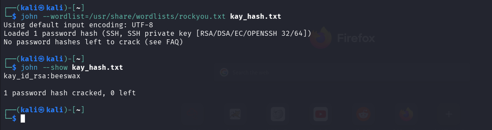

With the passphrase cracked, I could now use the key to log in as kay directly, without ever needing kay's account password.

```bash
ssh -i kay_id_rsa kay@10.65.139.250
```

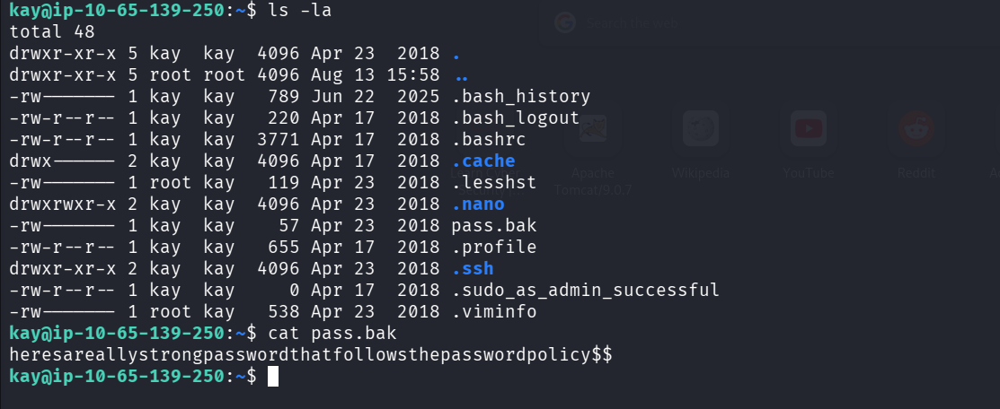

Reading `pass.bak` revealed a stored password string sitting in a plain text file in kay's home directory.

## 6. Findings Table

| # | Finding | Severity | Description |
|---|---------|----------|--------------|
| 1 | Sensitive files exposed under `/development` | Low | Publicly browsable directory revealed developer notes naming staff and hinting at a weak password. |
| 2 | Anonymous SMB access | Medium | The SMB share allowed login with no credentials and exposed a file naming staff accounts. |
| 3 | Weak SSH password (user: jan) | High | The password was guessed in minutes using Hydra against a common password list. |
| 4 | Private SSH key readable by other users | High | A second user's private key was stored with permissions allowing another local account to copy it. |
| 5 | Weak passphrase on private SSH key | Medium | The key was protected by a passphrase that was also cracked using a common password list. |
| 6 | Plaintext password stored in home directory | High | A file named `pass.bak` stored a password in plain, readable text. |

## 7. Remediation

| Finding | Fix | Owner | How to Verify |
|---------|-----|-------|----------------|
| Exposed `/development` directory | Remove the directory from the live web server, or move it behind authentication. Disable directory listing (`Options -Indexes` in Apache) on all web roots. | Web/system administrator | Browse to the path directly and confirm it returns a 403 or 404, and confirm no other test paths are listable. |
| Anonymous SMB access | Disable anonymous/guest access on the SMB service and require authentication for every share. | System administrator | Attempt an anonymous `smbclient` connection and confirm it is rejected. |
| Weak SSH password (jan) | Reset the account password to one that meets a real complexity and length standard, and enable account lockout after repeated failed attempts. | System administrator / account owner | Run the same wordlist attack in a controlled retest and confirm it no longer succeeds within a reasonable time, and confirm lockout triggers after the set number of attempts. |
| World-readable private key | Correct file and folder permissions so a user's home directory and `.ssh` folder are only readable by that user (`chmod 700` on the home folder and `.ssh`, `chmod 600` on key files). | System administrator | Log in as a different low-privilege user and confirm the files can no longer be listed or read. |
| Weak key passphrase | Reissue the SSH key pair with a strong, unique passphrase, or move to a managed key/agent solution. | Account owner (kay) | Attempt to crack the new key's passphrase with the same wordlist and confirm it fails. |
| Plaintext password file (`pass.bak`) | Delete the file. Store any saved credentials only in an approved password manager or secrets vault, never as plain text on disk. | Account owner (kay) | Search the home directory and any backups for similar files and confirm none remain. |

---


